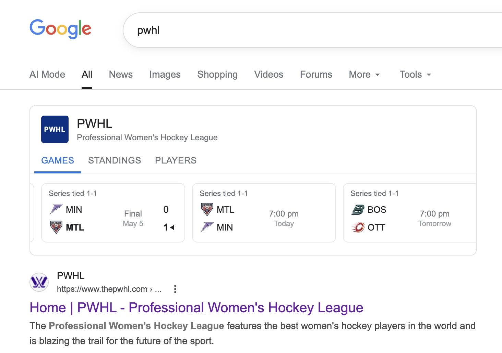

# PWHL on Google (Unofficial)

An unofficial Chrome extension that adds a PWHL sports panel to Google Search results when you search for **"pwhl"** — matching the native panels Google already shows for the NHL, NBA, MLB, and NFL.

## Features

- **Games** — recent and upcoming games with scores, live period/clock, and playoff series context (e.g. *Series tied 1-1*). Scrolls to show the last completed game and next upcoming game by default.
- **Standings** — full regular-season standings using the PWHL's 3-2-1-0 points system, with playoff-clinch markers.
- **Players** — top scorers for the current season.

Data is fetched live from the PWHL's official stats API (HockeyTech/LeagueStat) every time you search — nothing is hardcoded.

## Installation

Chrome does not allow installing extensions from outside the Web Store without enabling Developer Mode. This takes about 30 seconds:

1. Download **[pwhl-on-google-unofficial.zip](https://github.com/alecjacobson/pwhl/raw/main/pwhl-on-google-unofficial.zip)** and unzip it.
2. Open Chrome and go to `chrome://extensions`.
3. Enable **Developer mode** (toggle in the top-right corner).
4. Click **Load unpacked** and select the unzipped folder.
5. Search Google for [pwhl](https://www.google.com/search?q=pwhl).

To update, re-download the zip, replace the folder contents, and click the refresh icon on the extension card at `chrome://extensions`.

## Disclaimer

This is an unofficial fan-made extension and is not affiliated with or endorsed by the PWHL or any of its teams. Data is sourced from the same public API used by [thepwhl.com](https://www.thepwhl.com).
